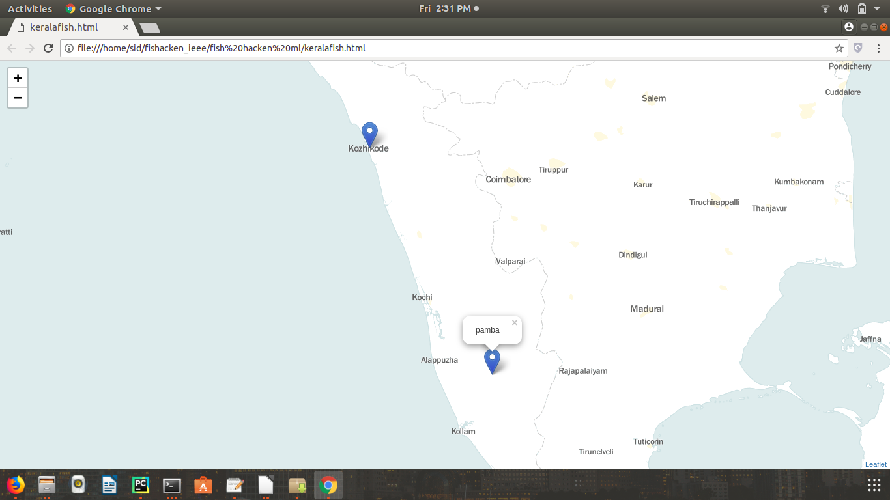

# Fishing-Zone-Pediction using decision tree algorithm in ML and plotting it in map
Identification of  fishing zones using machine learning, based on physical and chemical properties of the water.
## Description
Utilizing the remotely sensed data available from various satellites, Indian National Centre for Ocean Information Services (INCOIS), provides these advisories to the fishermen on a daily basis with specific references to fish landing centers along the Indian coast. However when these satellites do not work, there is no PFZ data for the fishermen, and they have to manually seacrh the oceans to find the fishing zone, which results in a waste of time, effort and resources. Hence, in such scenarios, we can use machine learning on past data for PFZ identification and then allow fishermen to follow the map plotted to get the status 

Enter the test data on test.csv with name,lat,lon,other chemical properties . This  actually  should be done by the INCOIS and then send the plotted map to fishermen.


## Prerquisites
```
Python 3.2 or higher

pip3 install sklearn
pip3 install pandas
pip3 instll numpy
pip3 intall tensorflow
pip3 install keras
pip3 install folium
```

